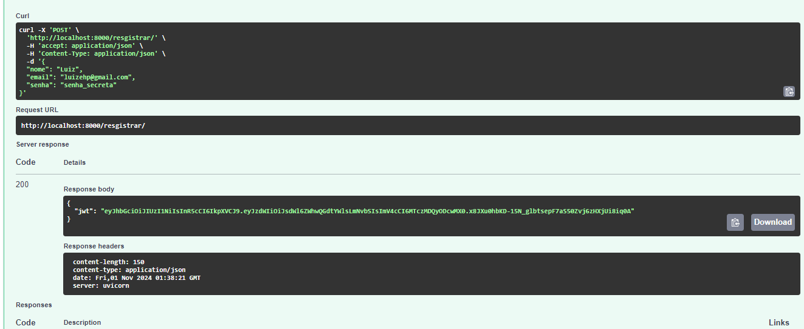
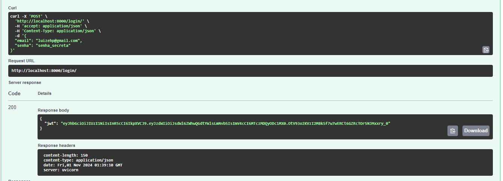
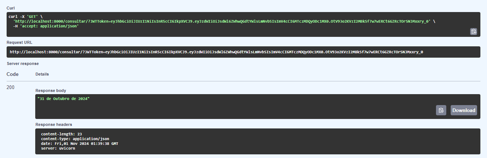

# Projeto Cloud - Luiz Eduardo Herreros Pini

## Descrição
O projeto consiste de uma API RESTful capaz de cadastrar e autenticar usuários utilizando criptografia com JWT para proteção da senha do usuário, além de uma api em MySql para manutenção e armazenamento de dados e um web scrapping que permite consulta dos dados do site [Data de hoje](https://datadehoje.com/).

## Principais Funcionalidades

1. Registro e autenticação de usuário utilizando JWT

2. Consulta a data de hoje

## Para Executar a Aplicação

1. Tenha o Docker instalado na sua máquina

2. Crie um arquivo .env com as seguintes variáveis

```bash
USER=                   #NOME DE USUÁRIO
PASSWORD=               #SENHA
NAME=                   #NOME DO DATABASE
MYSQL_ROOT_PASSWORD=    #SENHA USUÁRIO ROOT
SECRET_KEY=             #SENHA JWT
ALGORITHM=              #ALGORÍTIMO JWT
```

3. Crie um arquivo compose.yaml com o seguinte conteúdo

```yaml
services:

  db:
    image: mysql:9.1.0
    environment:
      MYSQL_ROOT_PASSWORD: ${ROOT_PASSWORD:-projeto}
      MYSQL_DATABASE: ${NAME:-projeto}
      MYSQL_USER: ${USER:-projeto}
      MYSQL_PASSWORD: ${PASSWORD:-projeto}
    ports:
      - "3307:3306"

  api:
    image: luizehp/app:3 
    environment:
      - USER=${USER:-projeto}
      - PASSWORD=${PASSWORD:-projeto}
      - SERVER=db
      - PORT=3306
      - NAME=${NAME:-projeto}
      - SECRET_KEY=${SECRET_KEY:-CAVALO}
      - ALGORITHM=${ALGORITHM:-HS256}
    ports:
      - "8000:8000"
    depends_on:
      - db
    restart: on-failure
```

4. Para iniciar o serviço, copie no terminal:

```bash
docker compose up -d
```

5. Acesse o site http://localhost:8000/docs#/ para acessar a aplicação


## Serviços

1. Registrar o usuário (POST /registrar/):
    - Utiliza os dados de nome, email e senha e registra o usuário no database transformando a senha em uma hash atravéz do JWT e retorna o toke

    

2. Login (POST /login/):
    - Utiliza dados de email e senha e verifica se o usuário ja foi registrado checando se o email está no sistema e comparando a hash da senha fronecida com a hash armazenada e retorna o token

    

3. Consulta a data de hoje (GET /consultar/):
    - Recebe o token fornecido no login e no cadastro e checa se ele é autêntico, caso seja, retorna a data de hoje

    


## Informações importantes
-  Localização do arquivo compose.yaml se encontra na raíz do repositório 
- Imagem do [`Docker Hub`](https://hub.docker.com/layers/luizehp/app/3/images/sha256-49d0833e9089a992a6b7a4ec6be2310f486137f5060bf99b0eee2a3ac9d333f0?context=repo)
- Link do [`vídeo de demonstração`](https://youtu.be/Yj8JbQCGS-I)